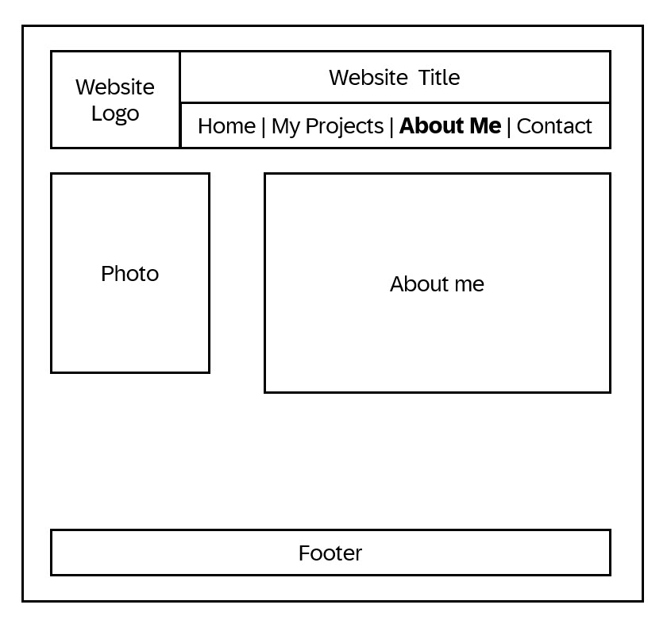
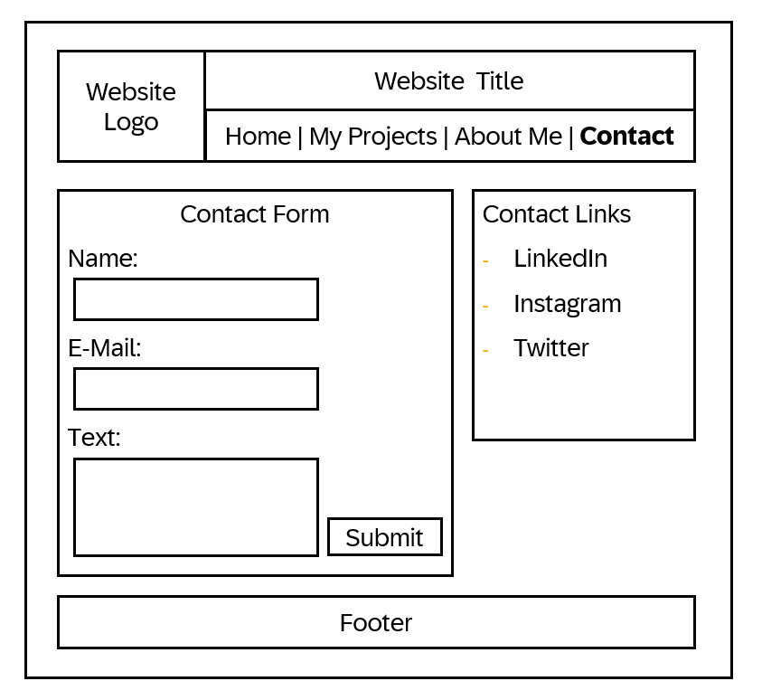

# Markus Spaeter's INF 6420 Project

## Wireframes
For this project I created wireframes for the following three pages: Index/Home, About Me and Contact.

### Home/Index

#### Top Box:
The top box is the header of the page. It will remain static for all sub-pages and includes the webstie logo and title and the navigation items.

#### Photo/Graphic:
Will include an ai generated related photo or graphic

#### Welcome Message:
This will include a welcome message and possibly a link to my business website.

#### Footer:
This will also remein the same for all pages and include copyright and legal disclaimer links.

### About Me

#### Photo:
will include a photo of me

#### About me:
will include information about my education, certifications and professional expieriences. 

### Contact

#### Contact Form:
Will include a contact form to get in touch with me.

#### Contact Links:
will include links to my profiles on other websites.